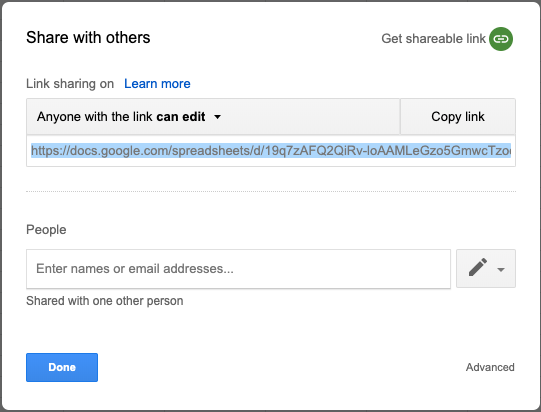

# Bills tracker

Track and share expenses with Google Drive spreadsheet.

## Onboarding

### 1. Create a spreadsheet and share it 

Share your spreadsheet with link sharing: *Anyone with th link can edit*.

### 2. Copy spreadsheet ID

For example, on `https://docs.google.com/spreadsheets/d/1qffzsCf2siRv-loAAMLeGzsSsmwcT3odSfmXBASO0fg/edit#gid=0` the ID is `1qffzsCf2siRv-loAAMLeGzsSsmwcT3odSfmXBASO0fg`.

### 3. Generate JSON file

#### Set up project and enable sheets API

1. Go to the [Google Developers Console](https://console.developers.google.com/)
2. Select your project or create a new one (and then select it)
3. Enable the Sheets API for your project
4. In the sidebar on the left, select APIs & Services > Library
5. Search for "sheets"
6. Click on "Google Sheets API"
7. click the blue "Enable" button

#### Create a service account for your project

1. In the sidebar on the left, select APIs & Services > Credentials
2. Click blue "+ CREATE CREDENITALS" and select "Service account" option
3. Enter name, description, click "CREATE"
4. You can skip permissions, click "CONTINUE"
5. Click "+ CREATE KEY" button
6. Select the "JSON" key type option
7. Click "Create" button
8. Your JSON key file is generated and downloaded to your machine (it is the only copy!)
9. click "DONE"

## Example

I have a functional example on [Netlify](https://sleepy-bhaskara-080018.netlify.com/)

## Next steps

- [] Validate inputs
- [] Show graphs
- [] Improve the code
- [] Editable expense type dropdown values

## Authors

**Joaquin Beceiro** 
- [GitHub](https://github.com/JoaquinBeceiro) 
- [Web](https://JoaquinBeceiro.com.uy)

